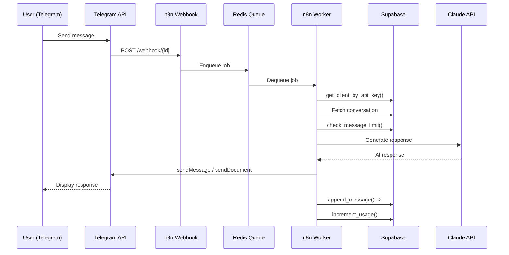

# Skill Scout -- Systems Architecture

> **Version:** 1.0.0
> **Last Updated:** 2026-03-07
> **Owner:** Technical Agent (Systems Architect)
> **Status:** Production-ready reference

---

## Table of Contents

1. [System Overview](#1-system-overview)
2. [Infrastructure Layer](#2-infrastructure-layer)
3. [n8n Automation Engine](#3-n8n-automation-engine)
4. [Database Architecture](#4-database-architecture)
5. [AI Pipeline](#5-ai-pipeline)
6. [Messaging Integration](#6-messaging-integration)
7. [Security Architecture](#7-security-architecture)
8. [File System Access](#8-file-system-access)
9. [Monitoring & Observability](#9-monitoring--observability)
10. [Deployment Pipeline](#10-deployment-pipeline)
11. [Scaling Strategy](#11-scaling-strategy)
12. [API Design](#12-api-design)
13. [Disaster Recovery](#13-disaster-recovery)
14. [Tech Debt & Future](#14-tech-debt--future)

---

## 1. System Overview

Skill Scout is a multi-tenant AI chatbot automation platform that delivers purpose-built bots with file and terminal access over Telegram (MVP) and WhatsApp Business API (Phase 2). The system is built on n8n for workflow automation, Supabase for client data and auth, and the Claude API for AI reasoning.

### 1.1 High-Level Architecture

```
                            INTERNET
                               |
                     +---------+---------+
                     |    Hetzner VPS    |
                     |  (Traefik :443)   |
                     +----+--------+-----+
                          |        |
              +-----------+        +-----------+
              |                                |
     +--------v--------+           +-----------v-----------+
     |   n8n (main)    |           |    Uptime Kuma        |
     |  UI + Webhooks  |           |  status.skillscout.io |
     +--------+--------+           +-----------------------+
              |
     +--------v--------+
     |  Redis (queue)  |
     +--------+--------+
              |
     +--------v--------+     +-------------------------+
     | n8n Worker(s)   +---->|  Claude API (Anthropic) |
     +-+------+------+-+     +-------------------------+
       |      |      |
       v      v      v
   +---+--+ ++-+ +--+---+
   |Supa- | |PG | |Tele- |
   |base  | |16 | |gram  |
   |(data)| |(n8n)| |Bot   |
   +------+ +---+ |API   |
                   +------+
```

### 1.2 Component Roles

| Component | Role | Boundary |
|-----------|------|----------|
| **Traefik** | TLS termination, reverse proxy, automatic Let's Encrypt | Public-facing |
| **n8n (main)** | Workflow editor, webhook receiver, scheduler | Public (behind Traefik) |
| **n8n (worker)** | Workflow execution engine | Internal only |
| **Redis** | Job queue (BullMQ), pub/sub for execution updates | Internal only |
| **PostgreSQL 16** | n8n internal state (workflows, credentials, executions) | Internal only |
| **Supabase** | Client data, conversations, files, usage, auth, storage | Hosted (external) |
| **Claude API** | AI reasoning, conversation responses, file assistance | External API |
| **Telegram Bot API** | Message delivery, file transfer (MVP) | External API |
| **Uptime Kuma** | Uptime monitoring, alerting | Public (behind Traefik) |
| **Next.js Frontend** | Portfolio/marketing website | Deployed separately |

### 1.3 Data Flow -- Telegram Message Lifecycle

```
User sends message via Telegram
        |
        v
Telegram Bot API ---webhook---> Traefik (:443)
                                    |
                                    v
                               n8n (main) receives webhook
                                    |
                                    v
                               Redis queue (enqueue job)
                                    |
                                    v
                               n8n Worker picks up job
                                    |
                    +---------------+----------------+
                    |               |                |
                    v               v                v
             Authenticate    Fetch context     Check limits
             (Supabase)      (Supabase)        (Supabase)
                    |               |                |
                    +-------+-------+----------------+
                            |
                            v
                     Claude API (generate response)
                            |
                            v
                +----------+-----------+
                |          |           |
                v          v           v
          Send reply   Log message  Increment usage
          (Telegram)   (Supabase)   (Supabase)
```

---

## 2. Infrastructure Layer

### 2.1 Hetzner VPS Specifications

| Attribute | Recommended (MVP) | Production Scale |
|-----------|-------------------|------------------|
| **Model** | CPX31 | CPX51 |
| **vCPUs** | 4 | 8 |
| **RAM** | 8 GB | 16 GB |
| **Storage** | 160 GB NVMe | 240 GB NVMe |
| **Bandwidth** | 20 TB/mo | 20 TB/mo |
| **Location** | Falkenstein (eu-central) | Falkenstein (eu-central) |
| **OS** | Ubuntu 22.04 LTS | Ubuntu 22.04 LTS |
| **Cost** | ~EUR 15/mo | ~EUR 30/mo |

### 2.2 Docker Compose Services

Six containers run on the VPS via Docker Compose (v3.9):

```
skillscout-traefik        Traefik v3.0          :80, :443 (public)
skillscout-postgres       PostgreSQL 16 Alpine  :5432 (internal)
skillscout-redis          Redis 7 Alpine        :6379 (internal)
skillscout-n8n            n8n (latest)          :5678 (via Traefik)
skillscout-n8n-worker     n8n worker            (internal)
skillscout-uptime-kuma    Uptime Kuma 1.x       :3001 (via Traefik)
```

### 2.3 Network Topology

```
                    INTERNET
                       |
            +----------+----------+
            |  skillscout-public  |     (bridge network)
            |  (Traefik-routed)   |
            +---+------+------+--+
                |      |      |
           Traefik   n8n   Uptime Kuma
                |
            +---+------------------+
            | skillscout-internal  |     (bridge, internal: true)
            | (no internet access) |
            +---+------+------+---+
                |      |      |
            Postgres  Redis  n8n-worker
                              + n8n (dual-homed)
```

**Key design decisions:**
- `skillscout-internal` is marked `internal: true` -- containers on this network cannot reach the internet directly. PostgreSQL and Redis are never exposed.
- n8n main is dual-homed (both networks) so it can receive Traefik traffic and reach internal services.
- n8n worker is internal-only; it does not serve HTTP traffic.

### 2.4 Volume Management

| Volume | Mount Path | Contents | Backup Priority |
|--------|------------|----------|-----------------|
| `postgres-data` | `/var/lib/postgresql/data` | n8n workflows, credentials, executions | **Critical** |
| `redis-data` | `/data` | Queue state, AOF persistence | Medium |
| `n8n-data` | `/home/node/.n8n` | n8n config, custom nodes, encryption key cache | **Critical** |
| `client-files` | `/data/client-files` | Staged files for delivery | High |
| `traefik-certs` | `/letsencrypt` | Let's Encrypt certificates, `acme.json` | Medium |
| `traefik-logs` | `/var/log/traefik` | Access logs | Low |
| `uptime-kuma-data` | `/app/data` | Monitoring config, history | Low |

### 2.5 Resource Limits

```yaml
# Defined in docker-compose.yml deploy.resources
Service          CPU Limit   RAM Limit   CPU Reserve   RAM Reserve
traefik          0.50        256 MB      0.10          64 MB
postgres         1.00        1 GB        0.25          256 MB
redis            0.50        512 MB      0.10          64 MB
n8n (main)       2.00        2 GB        0.50          512 MB
n8n-worker       2.00        2 GB        0.25          256 MB
uptime-kuma      0.50        512 MB      0.10          64 MB
─────────────────────────────────────────────────────────
Total max:       6.50        6.25 GB
```

---

## 3. n8n Automation Engine

### 3.1 Queue Mode Architecture

n8n runs in **queue mode** for production scalability. This separates webhook handling from workflow execution:

```
┌──────────────────┐     ┌───────────┐     ┌──────────────────┐
│   n8n (main)     │     │   Redis   │     │  n8n Worker(s)   │
│                  │     │  (BullMQ) │     │                  │
│  - Editor UI     │     │           │     │  - Executes      │
│  - Webhook recv  +────>│  Job      +────>│    workflows     │
│  - Scheduler     │     │  Queue    │     │  - Runs Code     │
│  - API server    │     │           │     │    nodes          │
│                  │<────+  Results  │<────+  - Calls APIs    │
└──────────────────┘     └───────────┘     └──────────────────┘
         │                                          │
         v                                          v
   ┌───────────┐                              ┌───────────┐
   │ PostgreSQL│  (shared)                    │ PostgreSQL│
   │   (n8n)   │<─────────────────────────────│   (n8n)   │
   └───────────┘                              └───────────┘
```

**Environment variables controlling queue mode:**
```
EXECUTIONS_MODE=queue
QUEUE_BULL_REDIS_HOST=redis
QUEUE_BULL_REDIS_PORT=6379
QUEUE_BULL_REDIS_PASSWORD=${REDIS_PASSWORD}
QUEUE_BULL_REDIS_DB=0
```

### 3.2 Main vs Worker Responsibilities

| Responsibility | Main | Worker |
|----------------|:----:|:------:|
| Editor UI | Yes | -- |
| Webhook reception | Yes | -- |
| Cron/schedule triggers | Yes | -- |
| Workflow execution | -- | Yes |
| Code node evaluation | -- | Yes |
| HTTP request execution | -- | Yes |
| Credential decryption | Yes | Yes |
| Execution history writes | -- | Yes |

### 3.3 Scaling Strategy

Workers are horizontally scalable:

```bash
# Scale to 3 workers
docker compose up -d --scale n8n-worker=3
```

All workers share the same PostgreSQL, Redis, encryption key, and credential store. Each worker pulls jobs from the same BullMQ queue with at-most-once delivery.

### 3.4 Webhook Handling

Traefik routes all traffic for `${N8N_HOST}` to the n8n main container on port 5678. n8n exposes webhooks at:

```
https://{N8N_HOST}/webhook/{webhook-id}         (production)
https://{N8N_HOST}/webhook-test/{webhook-id}    (testing)
```

Telegram Bot API is configured to POST updates to the production webhook URL. The webhook path is set via the Telegram `setWebhook` API call.

### 3.5 Credential Management

n8n encrypts all stored credentials using `N8N_ENCRYPTION_KEY`. This key:
- Must be set identically on main and all workers
- Is used for AES-256 encryption of credential values in PostgreSQL
- Must be backed up securely -- losing it means losing all stored credentials
- Should be 32+ character random string

### 3.6 Execution Data Retention

```
EXECUTIONS_DATA_SAVE_ON_ERROR=all
EXECUTIONS_DATA_SAVE_ON_SUCCESS=all
EXECUTIONS_DATA_SAVE_MANUAL_EXECUTIONS=true
EXECUTIONS_DATA_PRUNE=true
EXECUTIONS_DATA_MAX_AGE=720          # 30 days
```

---

## 4. Database Architecture

Skill Scout uses **two separate databases** for clear separation of concerns:

```
┌─────────────────────────────┐    ┌────────────────────────────┐
│    Supabase (Hosted)        │    │   PostgreSQL 16 (Docker)   │
│                             │    │                            │
│  Client-facing data:        │    │  n8n internal data:        │
│  - clients                  │    │  - workflow definitions    │
│  - conversations            │    │  - credentials (encrypted) │
│  - files (metadata)         │    │  - execution history       │
│  - usage                    │    │  - user accounts           │
│  - allowed_commands         │    │  - settings                │
│  - audit_log                │    │                            │
│                             │    │  Accessed only by n8n      │
│  + Supabase Storage         │    │  main + worker processes   │
│    (client-files bucket)    │    │                            │
│                             │    │  Connection via internal   │
│  + Supabase Auth            │    │  Docker network only       │
│  + Edge Functions           │    │                            │
└─────────────────────────────┘    └────────────────────────────┘
```

### 4.1 Supabase Schema Overview

#### Entity Relationship Diagram

```
┌──────────────┐       ┌──────────────────┐       ┌──────────────┐
│   clients    │       │  conversations   │       │    files     │
├──────────────┤       ├──────────────────┤       ├──────────────┤
│ id (PK)      │──┐    │ id (PK)          │   ┌──>│ id (PK)      │
│ name         │  │    │ client_id (FK)   │<──┤   │ client_id(FK)│
│ email (UQ)   │  ├───>│ platform         │   │   │ convo_id(FK) │
│ company      │  │    │ external_user_id │   │   │ filename     │
│ plan         │  │    │ messages (JSONB[])│  │   │ file_path    │
│ api_key (UQ) │  │    │ context (JSONB)  │   │   │ file_size    │
│ whatsapp_ph  │  │    │ status           │   │   │ mime_type    │
│ tg_bot_token │  │    │ created_at       │   │   │ upload_src   │
│ allowed_cmds │  │    │ updated_at       │   │   │ created_at   │
│ max_monthly  │  │    └──────────────────┘   │   └──────────────┘
│ created_at   │  │                           │
│ updated_at   │  │    ┌──────────────────┐   │   ┌──────────────┐
└──────────────┘  │    │     usage        │   │   │  audit_log   │
                  │    ├──────────────────┤   │   ├──────────────┤
                  ├───>│ id (PK)          │   │   │ id (PK)      │
                  │    │ client_id (FK)   │   │   │ client_id(FK)│
                  │    │ month            │   │   │ action       │
                  │    │ messages_sent    │   │   │ details(JSON)│
                  │    │ messages_received│   │   │ ip_address   │
                  │    │ commands_executed│   │   │ user_agent   │
                  │    │ files_transferred│   │   │ created_at   │
                  │    │ ai_tokens_used   │   │   └──────────────┘
                  │    │ cost_usd         │   │
                  │    │ UQ(client,month) │   │   ┌────────────────┐
                  │    └──────────────────┘   │   │allowed_commands│
                  │                           │   ├────────────────┤
                  └───────────────────────────┴──>│ id (PK)        │
                                                  │ client_id (FK) │
                                                  │ command_pattern│
                                                  │ description    │
                                                  │ is_enabled     │
                                                  │ created_at     │
                                                  └────────────────┘
```

#### Plans and Limits

| Plan | Monthly Messages | Target |
|------|-----------------|--------|
| `starter` | 1,000 | Small businesses, testing |
| `professional` | 5,000 | Growing businesses |
| `business` | 25,000 | Mid-market |
| `enterprise` | Unlimited (-1) | Custom contracts |

### 4.2 Row Level Security (RLS)

Every table has RLS enabled. The security model follows two patterns:

**Pattern 1 -- Client self-service (clients, conversations, files, usage, allowed_commands):**
```sql
-- Clients can only read/write their own data
CREATE POLICY {table}_select_own ON {table}
    FOR SELECT USING (client_id = auth.uid());

-- Service role bypasses for admin/n8n operations
CREATE POLICY {table}_service_role ON {table}
    FOR ALL USING (auth.role() = 'service_role');
```

**Pattern 2 -- Admin-only (audit_log):**
```sql
-- No client access; service_role only
CREATE POLICY audit_log_service_role ON audit_log
    FOR ALL USING (auth.role() = 'service_role');
```

### 4.3 Key Database Functions

| Function | Purpose | Called From |
|----------|---------|-------------|
| `increment_usage()` | Atomic upsert of monthly usage counters | n8n workflows (post-interaction) |
| `check_message_limit()` | Returns `true` if client hit monthly cap | n8n workflows (pre-interaction) |
| `get_client_by_api_key()` | Authenticates incoming requests by API key | n8n webhook auth step |
| `append_message()` | Appends JSONB message to conversation array | n8n workflows (post-response) |
| `log_audit_event()` | Creates immutable audit trail entry | n8n workflows, Edge Functions |

All functions use `SECURITY DEFINER` to bypass RLS when called via the service role.

### 4.4 Supabase Storage

```
Bucket: client-files
├── {client_id_1}/
│   ├── reports/
│   │   └── q1-report.pdf
│   └── contracts/
│       └── agreement.docx
├── {client_id_2}/
│   └── invoices/
│       └── invoice-001.xlsx
...

Config:
  - Public: false (private bucket)
  - Max file size: 50 MB
  - Allowed MIME types: PDF, DOCX, XLSX, ZIP, TXT, CSV, PNG, JPEG, GIF, WebP, MP4, MP3
```

Storage RLS ensures clients can only access files under their own `{client_id}/` folder prefix.

---

## 5. AI Pipeline

### 5.1 Claude API Integration

AI reasoning is handled by Claude via n8n's LangChain nodes. The integration follows this pattern:

```
┌─────────────────────────────────────────────────────┐
│  n8n LangChain Agent Node                           │
│                                                     │
│  ┌──────────────┐   ┌──────────────────────────┐   │
│  │ System Prompt │   │  Tools                   │   │
│  │ (dynamic per  │   │  - File Search (Code)    │   │
│  │  client)      │   │  - HTTP Request          │   │
│  └──────┬───────┘   └──────────┬───────────────┘   │
│         │                      │                    │
│         v                      v                    │
│  ┌──────────────────────────────────────────────┐   │
│  │        Claude (Anthropic) LLM Node           │   │
│  │        Model: claude-sonnet-4-20250514       │   │
│  │        Max tokens: 2048                      │   │
│  │        Temperature: 0.7                      │   │
│  └──────────────────────────────────────────────┘   │
└─────────────────────────────────────────────────────┘
```

### 5.2 Prompt Engineering Pattern

System prompts are dynamically assembled per client in the "Build AI Context" Code node:

```javascript
const systemPrompt = `You are an AI assistant for ${clientData.company || clientData.name}.
You help users via Telegram.

User info:
- Name: ${messageData.fullName}
- Username: @${messageData.username}
- Platform: Telegram

Client plan: ${clientData.plan}
Available commands: ${(clientData.allowed_commands || []).join(', ')}

Guidelines:
- Be helpful, concise, and professional
- If the user asks for a file, use the file search tool
- If you cannot fulfill a request, explain why clearly
- Keep responses under 4096 characters (Telegram limit)`;
```

**Key design decisions:**
- System prompt includes client context so the AI responds appropriately per tenant
- Commands are injected so the AI knows what the user's plan allows
- Platform-specific constraints (4096 char Telegram limit) are embedded in the prompt
- Temperature of 0.7 balances creativity and reliability for business conversations

### 5.3 Conversation Context Management

Context is loaded from Supabase and capped at the last 20 messages to control token usage:

```javascript
// In Build AI Context node
let recentMessages = [];
if (conv.messages && Array.isArray(conv.messages)) {
    recentMessages = conv.messages.slice(-20);
}
```

Messages are stored as JSONB arrays in the `conversations` table:
```json
{
    "role": "user",
    "content": "Can you send me the Q1 report?",
    "timestamp": "2026-03-07T14:30:00.000Z"
}
```

### 5.4 Token Tracking

Usage is tracked per interaction via `increment_usage()`:

```javascript
// After AI response is sent
{
    p_client_id: clientId,
    p_messages_sent: 1,
    p_messages_recv: 1,
    p_tokens_used: tokenCount  // from Claude response metadata
}
```

The `usage` table aggregates monthly totals with `cost_usd` computed based on plan rates and token pricing.

### 5.5 AI Tool Architecture

The LangChain agent has access to tools that extend its capabilities:

| Tool | Type | Purpose |
|------|------|---------|
| **File Search** | `toolCode` | Searches Supabase Storage for client files |
| **HTTP Request** | `toolHttpRequest` | Makes external API calls on behalf of the user |

Tools are sandboxed -- they run within the n8n Code node environment, not via system shell execution.

---

## 6. Messaging Integration

### 6.1 Telegram Bot API (MVP)



**Telegram Bot Setup:**
1. Create bot via @BotFather
2. Store bot token in n8n credentials (encrypted)
3. Set webhook URL: `https://{N8N_HOST}/webhook/{webhook-id}`
4. Bot receives all message updates

**Current Workflows:**

| Workflow | File | Function |
|----------|------|----------|
| Telegram Bot (AI Agent) | `workflows/telegram-bot-basic.json` | Full AI conversation with auth, context, tools |
| File Delivery | `workflows/file-delivery.json` | `/file` command handling, Supabase Storage delivery |

### 6.2 WhatsApp Business API (Phase 2)

> **CRITICAL:** Meta banned general-purpose AI chatbots from WhatsApp in January 2026. Only purpose-built business bots with specific, declared functionality are allowed.

**Compliance requirements:**
- Bot must serve a specific business function (not general chat)
- Business verification through Meta Business Manager
- Message templates must be pre-approved for outbound messages
- 24-hour conversation window for free-form replies
- Each client needs their own WhatsApp Business Account (WABA)

**Planned architecture:**

```
Client's WABA ──> Cloud API ──> n8n Webhook ──> Same pipeline as Telegram
                                                 (with WhatsApp-specific
                                                  formatting and limits)
```

**Key differences from Telegram:**

| Aspect | Telegram | WhatsApp |
|--------|----------|----------|
| Bot creation | @BotFather (free) | Meta Business verification (paid) |
| Message format | Markdown, HTML | Limited formatting, templates |
| File size limit | 50 MB | 100 MB (media), 16 MB (docs) |
| Pricing | Free | Per-conversation pricing |
| Template messages | Not required | Required for outbound |
| AI restrictions | None | Purpose-built only (Meta policy) |

### 6.3 Message Routing

The platform field in the `conversations` table supports routing to the correct messaging API:

```sql
platform TEXT NOT NULL CHECK (platform IN ('whatsapp', 'telegram', 'slack'))
```

Future architecture will use a routing node in n8n to direct outbound messages to the correct API based on `platform`.

---

## 7. Security Architecture

### 7.1 Sandboxing -- The Execute Command Ban

> **CVE-2026-1470 (CVSS 9.9):** The n8n Execute Command node allows arbitrary OS command execution. If any workflow is compromised, an attacker gains full shell access to the Docker container.

**MANDATORY RULE: Never use the Execute Command node.**

All code execution MUST use the **Code node** with n8n's built-in task runner sandbox:

```
BANNED:                              REQUIRED:
┌─────────────────────────┐          ┌─────────────────────────┐
│  Execute Command Node   │          │  Code Node (v2)         │
│  - Runs arbitrary shell │          │  - JavaScript sandbox   │
│  - Full OS access       │          │  - No filesystem access │
│  - CVE-2026-1470        │          │  - No child_process     │
│  - NEVER USE THIS       │          │  - Auditable            │
└─────────────────────────┘          └─────────────────────────┘
```

### 7.2 Authentication Layers

```
Layer 1: Traefik
  - TLS termination (Let's Encrypt)
  - HTTP -> HTTPS redirect

Layer 2: n8n Basic Auth
  - Protects editor UI
  - N8N_BASIC_AUTH_USER / N8N_BASIC_AUTH_PASSWORD

Layer 3: API Key Auth (per-client)
  - 32-byte hex key auto-generated per client
  - Validated via get_client_by_api_key() on every webhook call
  - Stored in Supabase clients table

Layer 4: Supabase RLS
  - Row-level security on every table
  - Client data isolation enforced at the database layer
  - Service role key used only by n8n (server-side)

Layer 5: Supabase Auth
  - JWT-based auth for client dashboard (future)
  - auth.uid() maps to clients.id for RLS
```

### 7.3 Credential Security

| Secret | Storage | Access |
|--------|---------|--------|
| n8n encryption key | Docker env var | n8n main + workers |
| PostgreSQL password | Docker env var | n8n + PostgreSQL |
| Redis password | Docker env var | n8n + Redis |
| Supabase service role key | n8n env var | n8n workflows |
| Supabase anon key | n8n env var | n8n workflows |
| Telegram bot tokens | n8n credential store (encrypted) | n8n workflows |
| Anthropic API key | n8n credential store (encrypted) | n8n workflows |
| Client API keys | Supabase clients table | n8n via RPC |
| Let's Encrypt certs | Traefik volume | Traefik |

### 7.4 Audit Logging

Every significant action is logged to the `audit_log` table:

```javascript
// Example: file delivery audit
{
    p_client_id: clientId,
    p_action: 'file_delivered',
    p_details: {
        filename: 'report.pdf',
        requested_by: userId,
        platform: 'telegram',
        found: true
    }
}
```

The audit log has no client-facing RLS policies -- it is accessible only via the service role key. It is append-only by design (no UPDATE or DELETE policies for clients).

### 7.5 Rate Limiting

Rate limiting operates at multiple levels:

1. **Message limit (application):** `check_message_limit()` checks monthly totals before processing
2. **Redis queue (infrastructure):** BullMQ provides natural backpressure -- if workers are saturated, jobs queue
3. **Traefik (network):** Can be configured with rate limiting middleware:

```yaml
# Example Traefik rate limit (add to docker-compose labels)
- "traefik.http.middlewares.rate-limit.ratelimit.average=100"
- "traefik.http.middlewares.rate-limit.ratelimit.burst=50"
- "traefik.http.middlewares.rate-limit.ratelimit.period=1m"
```

### 7.6 Input Sanitization

The file delivery workflow sanitizes filenames to prevent path traversal:

```javascript
// Strip path traversal attempts
const sanitizedFilename = filename
    .replace(/\.\.\//g, '')   // Remove ../
    .replace(/\//g, '')       // Remove /
    .trim();
```

---

## 8. File System Access

### 8.1 Sandboxed File Access Pattern

File access is the platform's key differentiator. The architecture ensures complete client isolation:

```
┌──────────────┐     ┌─────────────┐     ┌───────────────────┐
│  User sends  │     │  n8n Worker │     │ Supabase Storage  │
│  /file cmd   │────>│  validates  │────>│                   │
│  via Telegram│     │  + searches │     │  client-files/    │
└──────────────┘     └──────┬──────┘     │  ├── {client_a}/  │
                            │            │  │   └── file.pdf  │
                            │            │  ├── {client_b}/  │
                            │            │  │   └── data.csv  │
                            v            │  └── ...           │
                     ┌──────────────┐    └───────────────────┘
                     │  Download    │           │
                     │  binary      │<──────────┘
                     │  from bucket │
                     └──────┬───────┘
                            │
                            v
                     ┌──────────────┐
                     │  Send file   │
                     │  via Telegram│
                     │  sendDocument│
                     └──────────────┘
```

### 8.2 Client Isolation

Isolation is enforced at three levels:

1. **Storage RLS:** Supabase Storage policies restrict access to `{client_id}/*` paths
2. **Query filtering:** All file queries include `client_id=eq.{client_id}` filter
3. **Path sanitization:** Path traversal characters (`../`, `/`) are stripped from user input

### 8.3 File Search Flow (file-delivery.json)

```
Telegram Trigger
  --> Parse File Command (sanitize filename)
    --> Valid /file Command?
      YES --> Search File in Database (Supabase ilike query)
        --> Evaluate Search Results (exact match > partial match)
          --> File Found?
            YES --> Download from Storage --> Send via Telegram --> Log + Audit
            NO  --> AI File Assistant (Claude) --> Send help message --> Audit
      NO  --> Send Usage Help ("/file filename.ext")
```

### 8.4 Local File Staging

n8n workers also have access to a shared Docker volume for local file staging:

```yaml
volumes:
  - client-files:/data/client-files
```

This volume is mounted on both n8n main and worker containers. It can be used for:
- Temporary file processing before upload to Supabase Storage
- Caching frequently-requested files
- Staging files generated by Code nodes

---

## 9. Monitoring & Observability

### 9.1 Uptime Kuma

Uptime Kuma runs at `https://${MONITORING_HOST}` behind Traefik with auto-SSL.

**Recommended monitors:**

| Monitor | Type | Target | Interval |
|---------|------|--------|----------|
| n8n Health | HTTP | `http://skillscout-n8n:5678/healthz` | 60s |
| n8n Webhooks | HTTP(s) | `https://{N8N_HOST}/webhook-test/ping` | 60s |
| PostgreSQL | TCP | `skillscout-postgres:5432` | 30s |
| Redis | TCP | `skillscout-redis:6379` | 30s |
| Supabase API | HTTP(s) | `https://{project}.supabase.co/rest/v1/` | 120s |
| Telegram API | HTTP(s) | `https://api.telegram.org/bot{token}/getMe` | 120s |
| Claude API | HTTP(s) | `https://api.anthropic.com/v1/messages` | 300s |
| Frontend | HTTP(s) | `https://skillscout.io` | 60s |

**Alerting channels:**
- Telegram notification group (primary)
- Email (fallback)

### 9.2 n8n Execution Logging

n8n's built-in execution log captures:
- Every workflow execution with full input/output data
- Execution duration, status (success/error/warning)
- Node-level timing and data snapshots
- Error messages and stack traces

Retention: 30 days (`EXECUTIONS_DATA_MAX_AGE=720` hours), auto-pruned.

### 9.3 Health Checks

Every Docker service has a health check configured:

```yaml
# Example: n8n health check
healthcheck:
  test: ["CMD-SHELL", "wget -qO- http://localhost:5678/healthz || exit 1"]
  interval: 30s
  timeout: 10s
  retries: 3
  start_period: 60s
```

Docker's health check system provides:
- Automatic restart of unhealthy containers (`restart: unless-stopped`)
- Dependency ordering via `condition: service_healthy`
- Health status visible in `docker compose ps`

### 9.4 Log Aggregation

```bash
# Follow all service logs
docker compose logs -f

# Follow specific service
docker compose logs -f n8n n8n-worker

# Traefik access logs (on disk)
docker exec skillscout-traefik tail -f /var/log/traefik/access.log
```

Future enhancement: ship logs to Grafana Loki or similar for centralized search.

---

## 10. Deployment Pipeline

### 10.1 Coolify CI/CD

Coolify (self-hosted PaaS on Hetzner) manages deployments:

```
Git Push (main branch)
    |
    v
Coolify detects change
    |
    v
Build Docker image (if applicable)
    |
    v
Pull latest images (n8n, redis, postgres, etc.)
    |
    v
Rolling restart of services
    |
    v
Health check verification
    |
    v
Deployment complete
```

### 10.2 Docker Image Management

| Service | Image | Update Strategy |
|---------|-------|-----------------|
| Traefik | `traefik:v3.0` | Pin major version, update minor |
| PostgreSQL | `postgres:16-alpine` | Pin major version |
| Redis | `redis:7-alpine` | Pin major version |
| n8n | `docker.n8n.io/n8nio/n8n:latest` | Watch releases, test before update |
| Uptime Kuma | `louislam/uptime-kuma:1` | Pin major version |
| Frontend | Custom Next.js image | Built on deploy |

**n8n update procedure:**
1. Check n8n release notes for breaking changes
2. Backup PostgreSQL (`pg_dump`)
3. Pull new image: `docker compose pull n8n n8n-worker`
4. Restart: `docker compose up -d n8n n8n-worker`
5. Verify health checks pass
6. Test critical workflows manually

### 10.3 Environment Variables

All secrets and configuration are managed via a `.env` file on the VPS:

```bash
# .env (never committed to git)
# --- Domains ---
N8N_HOST=n8n.skillscout.io
MONITORING_HOST=status.skillscout.io
ACME_EMAIL=admin@skillscout.io

# --- PostgreSQL (n8n internal) ---
POSTGRES_USER=n8n
POSTGRES_PASSWORD=<generated>
POSTGRES_DB=n8n

# --- Redis ---
REDIS_PASSWORD=<generated>

# --- n8n ---
N8N_ENCRYPTION_KEY=<generated-32-chars>
N8N_BASIC_AUTH_USER=admin
N8N_BASIC_AUTH_PASSWORD=<generated>

# --- Supabase ---
SUPABASE_URL=https://<project>.supabase.co
SUPABASE_ANON_KEY=<from-supabase-dashboard>
SUPABASE_SERVICE_ROLE_KEY=<from-supabase-dashboard>

# --- Client (MVP single-tenant) ---
CLIENT_API_KEY=<from-supabase-clients-table>
CLIENT_ID=<uuid-from-supabase>

# --- Timezone ---
TIMEZONE=UTC
```

### 10.4 Secrets Management

Current approach (MVP): `.env` file on VPS with restricted permissions (`chmod 600`).

Future approach: Docker Secrets or HashiCorp Vault for production multi-tenant deployment.

---

## 11. Scaling Strategy

### 11.1 Horizontal Worker Scaling

```
Load Level       Workers    Approx Throughput
────────────────────────────────────────────
Development      1          ~50 msg/min
MVP Launch       1-2        ~100 msg/min
Growth           3-5        ~250 msg/min
Scale            5-10       ~500 msg/min
```

Scaling workers: `docker compose up -d --scale n8n-worker=N`

### 11.2 Redis Queue Management

Redis configuration:
```
maxmemory 256mb
maxmemory-policy allkeys-lru    # Evict least-recently-used keys when full
appendonly yes                  # AOF persistence for durability
appendfsync everysec            # Fsync every second (balance speed/safety)
```

BullMQ queue monitoring:
- n8n provides built-in queue status in the admin panel
- Redis CLI: `redis-cli -a $REDIS_PASSWORD LLEN bull:n8n:waiting`

### 11.3 Database Connection Pooling

**n8n PostgreSQL:** Managed internally by n8n's connection pool. For high-scale deployments, consider PgBouncer in front of PostgreSQL.

**Supabase:** Uses Supabase's built-in connection pooler (PgBouncer). For n8n workflows, all database access goes through the REST API (`/rest/v1/`), not direct PostgreSQL connections, so pooling is handled by Supabase infrastructure.

### 11.4 Vertical Scaling Path

```
Phase 1 (MVP):     CPX31  (4 vCPU,  8 GB,  160 GB)  ~EUR 15/mo
Phase 2 (Growth):  CPX51  (8 vCPU, 16 GB,  240 GB)  ~EUR 30/mo
Phase 3 (Scale):   CCX33 (8 vCPU, 32 GB,  240 GB)   ~EUR 55/mo
Phase 4 (Multi):   Multiple VPS with load balancer
```

---

## 12. API Design

### 12.1 Webhook Endpoints

| Endpoint | Method | Purpose | Auth |
|----------|--------|---------|------|
| `/webhook/{telegram-webhook-id}` | POST | Telegram bot updates | Telegram IP allowlist |
| `/webhook/{file-delivery-webhook}` | POST | File delivery commands | Telegram IP allowlist |
| `/webhook-test/{id}` | POST | Webhook testing (editor) | n8n basic auth |

### 12.2 Supabase REST API (used by n8n)

n8n workflows access Supabase via its auto-generated REST API:

```
# RPC calls (functions)
POST /rest/v1/rpc/get_client_by_api_key
POST /rest/v1/rpc/check_message_limit
POST /rest/v1/rpc/increment_usage
POST /rest/v1/rpc/append_message
POST /rest/v1/rpc/log_audit_event

# Table queries (CRUD)
GET  /rest/v1/conversations?client_id=eq.{id}&platform=eq.telegram&...
GET  /rest/v1/files?client_id=eq.{id}&filename=ilike.*{query}*

# Storage
GET  /storage/v1/object/client-files/{client_id}/{path}
POST /storage/v1/object/client-files/{client_id}/{path}

# Auth headers (all requests)
apikey: {SUPABASE_ANON_KEY}
Authorization: Bearer {SUPABASE_SERVICE_ROLE_KEY}
```

### 12.3 Supabase Edge Functions (Planned)

Future Edge Functions for operations that should not run in n8n:

| Function | Purpose |
|----------|---------|
| `validate-webhook` | Verify Telegram webhook signatures |
| `usage-report` | Generate monthly usage PDFs |
| `billing-sync` | Sync usage to Stripe for billing |

### 12.4 Internal API Patterns

n8n-to-n8n communication via sub-workflows:

```
Main Workflow ──> Execute Workflow node ──> Sub-Workflow
                  (by workflow ID)          (reusable logic)
```

Example sub-workflows:
- Auth sub-workflow (validate API key, check limits)
- Logging sub-workflow (audit + usage in one call)
- Error handler sub-workflow (format error, notify admin)

---

## 13. Disaster Recovery

### 13.1 Backup Strategy

| Data | Method | Frequency | Retention | Priority |
|------|--------|-----------|-----------|----------|
| n8n PostgreSQL | `pg_dump` via cron | Daily | 30 days | **Critical** |
| n8n data volume | Volume snapshot | Weekly | 4 weeks | Critical |
| Redis AOF | Volume snapshot | Weekly | 2 weeks | Medium |
| Supabase data | Supabase daily backups (Pro plan) | Daily | 30 days | **Critical** |
| `.env` file | Encrypted copy in password manager | On change | Permanent | **Critical** |
| Docker Compose | Git repository | On change | Permanent | Critical |
| Traefik certs | Auto-renewed by Let's Encrypt | N/A | N/A | Low |

### 13.2 Backup Script

```bash
#!/bin/bash
# /opt/skillscout/backup.sh
# Run via cron: 0 3 * * * /opt/skillscout/backup.sh

BACKUP_DIR="/opt/skillscout/backups"
DATE=$(date +%Y%m%d_%H%M%S)
RETENTION_DAYS=30

mkdir -p "$BACKUP_DIR"

# 1. PostgreSQL dump
docker exec skillscout-postgres \
    pg_dump -U "$POSTGRES_USER" -d "$POSTGRES_DB" \
    | gzip > "$BACKUP_DIR/n8n-postgres-${DATE}.sql.gz"

# 2. n8n data (credentials, config)
docker run --rm \
    -v n8n-data:/source:ro \
    -v "$BACKUP_DIR":/backup \
    alpine tar czf "/backup/n8n-data-${DATE}.tar.gz" -C /source .

# 3. Cleanup old backups
find "$BACKUP_DIR" -name "*.gz" -mtime +$RETENTION_DAYS -delete

# 4. Optional: upload to S3/B2/Hetzner Storage Box
# rclone copy "$BACKUP_DIR" remote:skillscout-backups/
```

### 13.3 Restore Procedures

**n8n PostgreSQL restore:**
```bash
# Stop n8n services
docker compose stop n8n n8n-worker

# Restore from backup
gunzip < backups/n8n-postgres-YYYYMMDD.sql.gz | \
    docker exec -i skillscout-postgres psql -U $POSTGRES_USER -d $POSTGRES_DB

# Restart services
docker compose up -d n8n n8n-worker
```

**Full VPS recovery (new server):**
1. Provision new Hetzner VPS (same or larger specs)
2. Install Docker Engine + Docker Compose
3. Clone the repository
4. Restore `.env` from password manager
5. Restore PostgreSQL backup
6. Restore n8n-data volume
7. `docker compose up -d`
8. Update DNS records
9. Wait for Let's Encrypt certificates
10. Re-set Telegram webhook URL

### 13.4 Data Retention

| Data Type | Retention | Deletion Method |
|-----------|-----------|-----------------|
| n8n executions | 30 days | Auto-pruned by n8n |
| Conversations | Indefinite (archivable) | Status set to `archived` |
| Audit log | Indefinite (compliance) | Never deleted |
| Usage records | Indefinite (billing) | Never deleted |
| Client files | Until client deletes | Supabase Storage API |
| Traefik access logs | 7 days | Logrotate |
| Backups | 30 days | Backup script cleanup |

---

## 14. Tech Debt & Future

### 14.1 Known Limitations

| Limitation | Impact | Mitigation |
|------------|--------|------------|
| Single-VPS deployment | Single point of failure | Daily backups, fast recovery procedure |
| `n8n:latest` tag | Uncontrolled updates possible | Pin to specific version before production |
| Single Redis instance | No HA for queue | Acceptable at current scale |
| Messages stored as JSONB array | Performance degrades with long conversations | Archive conversations at 500+ messages |
| File search is basic (ilike) | No full-text or fuzzy search | Acceptable for MVP; add pg_trgm later |
| No rate limiting at Traefik level | Potential abuse | Add rate limit middleware before launch |
| MVP is single-tenant | Only one client per deployment | Implement multi-tenant routing in Phase 2 |

### 14.2 Planned Upgrades

**Phase 2 (Q2 2026):**
- [ ] WhatsApp Business API integration (purpose-built bots only)
- [ ] Multi-tenant webhook routing (one n8n instance, many clients)
- [ ] Supabase Edge Functions for webhook validation and billing
- [ ] Pin n8n to specific version with automated update testing
- [ ] Add Traefik rate limiting middleware
- [ ] Implement conversation archival at message threshold

**Phase 3 (Q3 2026):**
- [ ] Client dashboard (Next.js + Supabase Auth)
- [ ] Stripe integration for automated billing
- [ ] Full-text search for files (pg_trgm or Supabase Full Text Search)
- [ ] Multi-VPS deployment with load balancer
- [ ] Centralized logging (Grafana Loki)
- [ ] Slack integration (third messaging platform)

**Phase 4 (Q4 2026):**
- [ ] Custom AI model fine-tuning per client vertical
- [ ] React Three Fiber 3D elements on portfolio site
- [ ] Kubernetes migration (if scale demands it)
- [ ] SOC 2 compliance preparation
- [ ] White-label option for enterprise clients

### 14.3 Migration Paths

| Current | Future | Trigger |
|---------|--------|---------|
| Single VPS | Multi-VPS + LB | >500 concurrent users |
| Docker Compose | Kubernetes (K3s) | >10 worker nodes needed |
| Supabase hosted | Self-hosted Supabase | Cost exceeds EUR 100/mo or compliance needs |
| Redis single | Redis Sentinel/Cluster | Queue reliability becomes critical |
| `.env` secrets | HashiCorp Vault | Multi-team access to secrets |
| Manual deploys | GitHub Actions + Coolify webhooks | Team size >2 |

### 14.4 Architecture Decision Records

| Decision | Rationale | Date |
|----------|-----------|------|
| Two separate databases | Supabase for client data (RLS, auth, storage) vs PostgreSQL for n8n internals (workflows, credentials) -- clear ownership | 2026-03 |
| Queue mode from day one | Avoids migration pain later; enables horizontal scaling | 2026-03 |
| Telegram first, WhatsApp second | Telegram has no AI bot restrictions; WhatsApp requires business verification and purpose-built compliance | 2026-03 |
| Code node over Execute Command | CVE-2026-1470 (CVSS 9.9) -- Execute Command is a critical security risk | 2026-03 |
| Supabase Storage over local filesystem | Client isolation via RLS, no volume management complexity, built-in CDN | 2026-03 |
| n8n LangChain nodes over direct API | Provides tool use, memory, and agent patterns out of the box | 2026-03 |

---

## Appendix A: Environment Variable Reference

```bash
# Required for all deployments
N8N_HOST                     # n8n domain (e.g., n8n.skillscout.io)
MONITORING_HOST              # Uptime Kuma domain
ACME_EMAIL                   # Let's Encrypt email
POSTGRES_USER                # n8n PostgreSQL user
POSTGRES_PASSWORD            # n8n PostgreSQL password
POSTGRES_DB                  # n8n PostgreSQL database name
REDIS_PASSWORD               # Redis auth password
N8N_ENCRYPTION_KEY           # AES-256 key for n8n credential encryption
N8N_BASIC_AUTH_USER          # n8n editor login
N8N_BASIC_AUTH_PASSWORD      # n8n editor password
SUPABASE_URL                 # Supabase project URL
SUPABASE_ANON_KEY            # Supabase anonymous key
SUPABASE_SERVICE_ROLE_KEY    # Supabase service role key (admin)
CLIENT_API_KEY               # Client API key (MVP single-tenant)
CLIENT_ID                    # Client UUID (MVP single-tenant)

# Optional
TIMEZONE                     # Default: UTC
```

## Appendix B: Port Map

```
Port     Service              Network          Public?
──────────────────────────────────────────────────────
80       Traefik (HTTP)       skillscout-public  Yes (redirects to 443)
443      Traefik (HTTPS)      skillscout-public  Yes
5678     n8n (internal)       both               No (via Traefik only)
5432     PostgreSQL           skillscout-internal No
6379     Redis                skillscout-internal No
3001     Uptime Kuma          both               No (via Traefik only)
```

## Appendix C: Docker Compose Quick Reference

```bash
# Start all services
docker compose up -d

# View service status and health
docker compose ps

# Follow logs
docker compose logs -f

# Scale workers
docker compose up -d --scale n8n-worker=3

# Restart n8n (zero-downtime with workers)
docker compose restart n8n

# Update images
docker compose pull && docker compose up -d

# Stop everything
docker compose down

# Stop and remove volumes (DESTRUCTIVE)
docker compose down -v
```
